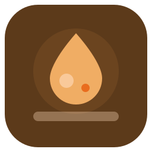

<p align="center">
  
</p>

<h1 align="center">Material Gnome</h1>

<p align="center">
  <strong>Turn your GNOME desktop into a pixel-perfect Material You experience.</strong><br>
  Dark theme. 8 accent colors. 19 components. One click.
</p>

<p align="center">
  <a href="#quick-start"></a>&nbsp;
  &nbsp;
  &nbsp;
  
</p>

---

The installer ships as a native **GTK4 / libadwaita** app with adaptive layout, live color preview, and a Material 3 interface. Every color, every icon, every pixel is designed to feel cohesive across your entire system -- from the GNOME Shell top bar down to the boot screen.

Built for **Bazzite / Fedora Silverblue** but works on any GNOME 45+ distribution.

<br>

<p align="center">
  
</p>

<p align="center">
  
</p>

<p align="center">
  
  &nbsp;&nbsp;&nbsp;
  
</p>

<br>

---

<br>

## What you get

| Area | Details |
|---|---|
| **GNOME Shell** | Top bar, quick settings, notifications, OSD, overview, calendar, lock screen |
| **GTK4 / libadwaita** | Nautilus, Settings, Text Editor, and every modern GNOME app |
| **GTK3** | Legacy applications |
| **Firefox** | Custom `userChrome.css` and `userContent.css` |
| **Terminal** | Ptyxis palette with matched background, cursor, and ANSI colors |
| **Fonts** | Inter, Fira Code, Noto Serif |
| **Icons** | Papirus-Dark with colored folders |
| **Cursors** | Bibata Modern Classic |
| **Extensions** | 12 GNOME Shell extensions, pre-configured |
| **dconf** | 57 system settings -- accent color, Flatpak overrides, night light, keybindings |
| **Boot** | rEFInd theme and Plymouth spinner |
| **GDM** | Login screen with matching colors and font |
| **Wallpaper** | Dark lockscreen wallpaper |
| **Burn My Windows** | Close animation profile |
| **Fastfetch** | Styled terminal system info |
| **Backup** | Full undo with timestamped backups |

<br>

## Accent colors

Pick your accent at install time. Switch anytime with the **Aggiorna** button -- all CSS files, Papirus folder icons, terminal palette, dconf settings, and running apps update live. No restart needed.

<table align="center">
<tr>
<td align="center"><br><sub>Orange</sub></td>
<td align="center"><br><sub>Blue</sub></td>
<td align="center"><br><sub>Green</sub></td>
<td align="center"><br><sub>Purple</sub></td>
<td align="center"><br><sub>Red</sub></td>
<td align="center"><br><sub>Teal</sub></td>
<td align="center"><br><sub>Pink</sub></td>
<td align="center"><br><sub>Yellow</sub></td>
</tr>
</table>

<br>

## Quick start

### GUI installer

```bash
git clone https://github.com/mengo1234/material-gnome.git
cd material-gnome
python3 material-you-installer-gui.py
```

### TUI installer

```bash
python3 material_you_installer.py
```

The TUI walks through the same 19 steps with interactive prompts. Works in any terminal.

<br>

## Requirements

- GNOME 45 or later (tested on GNOME 49.1)
- Python 3.10+
- `gtk4` + `libadwaita` (GUI only)
- `sudo` access for system-level steps (GDM, rEFInd, Plymouth, DING)

<br>

## How it works

The installer copies pre-built CSS and config files from `theme/` into the right locations:

```
theme/
  gnome-shell/   ->  ~/.themes/Material-You-Orange/gnome-shell/
  gtk-4.0/       ->  ~/.config/gtk-4.0/
  gtk-3.0/       ->  ~/.config/gtk-3.0/
  firefox/       ->  ~/.mozilla/firefox/<profile>/chrome/
  ptyxis/        ->  ~/.local/share/org.gnome.Ptyxis/palettes/
  fastfetch/     ->  ~/.config/fastfetch/
  wallpaper/     ->  lockscreen background
  gdm/           ->  /etc/dconf/db/gdm.d/
  refind/        ->  /boot/efi/EFI/refind/
```

Components that are already installed show a checkmark. Nothing is overwritten without a backup first.

<br>

## Immutable distro support

On Bazzite, Fedora Silverblue, and other ostree-based systems the installer automatically uses `/etc` overlays instead of writing to the read-only `/usr` partition. System-level steps (GDM, Plymouth, rEFInd) are handled transparently.

<br>

## Uninstall

Every step creates a timestamped backup in `~/.local/share/material-you-orange/backups/`. Run the TUI and select restore to roll back individual components or everything at once.

<br>

## Project structure

```
material-you-installer-gui.py    GTK4/libadwaita GUI application
material_you_installer.py        TUI installer and core step definitions
material-you-installer.py        Legacy TUI entry point
theme/                           Pre-built CSS, configs, and assets
screenshots/                     App screenshots
```

<br>

## License

MIT
