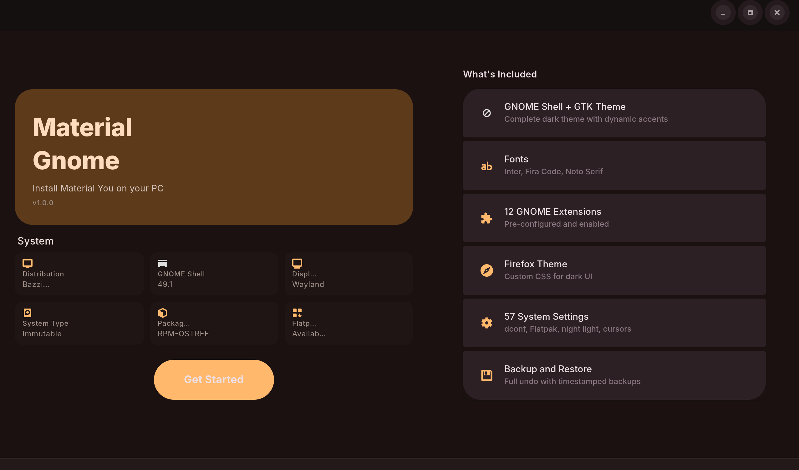
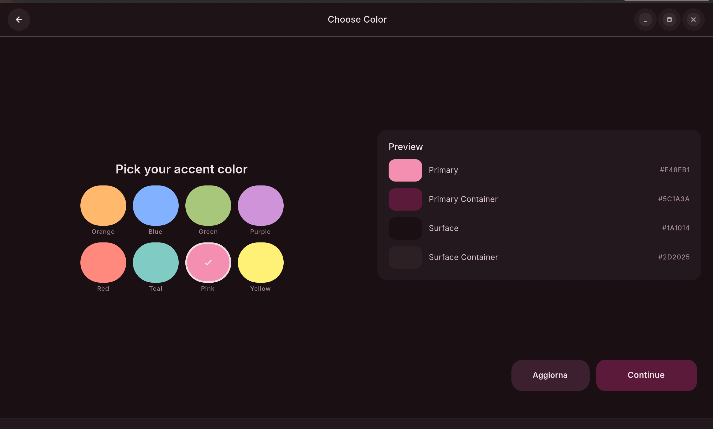
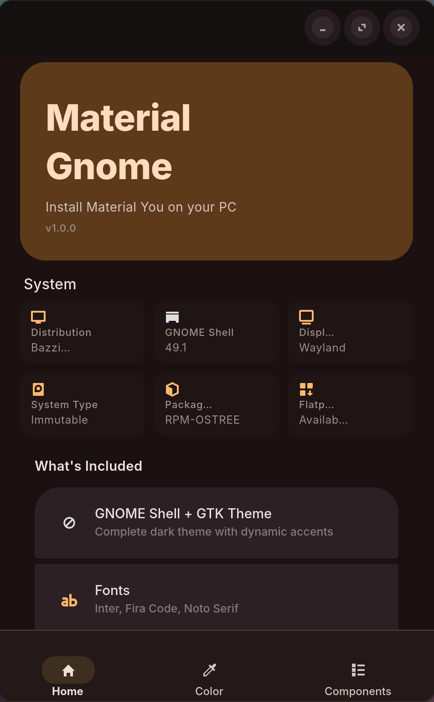
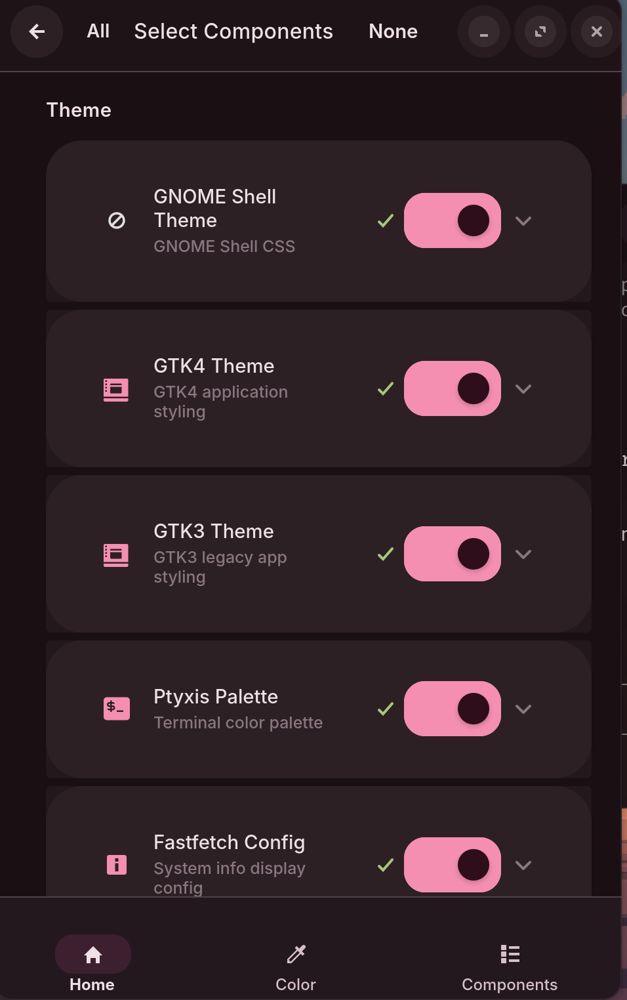

# Material Gnome

A complete Material You dark theme for GNOME desktops. One installer, 19 components, 8 accent colors. Ships with a native GTK4 GUI and a full TUI installer.

Built for Bazzite / Fedora Silverblue but works on any GNOME 45+ distribution.

---

<p align="center">
  
</p>

<p align="center">
  
</p>

<p align="center">
  
  &nbsp;&nbsp;
  
</p>

---

## What you get

| Area | Details |
|---|---|
| GNOME Shell | Top bar, quick settings, notifications, OSD, overview, calendar, lock screen |
| GTK4 / libadwaita | Nautilus, Settings, Text Editor, and every modern GNOME app |
| GTK3 | Legacy applications |
| Firefox | Custom `userChrome.css` and `userContent.css` |
| Terminal | Ptyxis palette with matched background, cursor, and ANSI colors |
| Fonts | Inter, Fira Code, Noto Serif |
| Icons | Papirus-Dark with colored folders |
| Cursors | Bibata Modern Classic |
| Extensions | 12 GNOME Shell extensions, pre-configured |
| dconf | 57 system settings: accent color, Flatpak overrides, night light, keybindings |
| Boot | rEFInd theme and Plymouth spinner |
| GDM | Login screen with matching colors and font |
| Wallpaper | Dark lockscreen wallpaper |
| Burn My Windows | Close animation profile |
| Fastfetch | Styled terminal system info |
| Backup | Full undo with timestamped backups |

## Accent colors

Pick your accent at install time. Switch it later with the **Aggiorna** button -- all CSS files, Papirus folder icons, terminal palette, dconf accent, and running apps update live.

| Orange | Blue | Green | Purple | Red | Teal | Pink | Yellow |
|:---:|:---:|:---:|:---:|:---:|:---:|:---:|:---:|
| `#ffb86c` | `#82b1ff` | `#a8c77a` | `#ce93d8` | `#ef9a9a` | `#80cbc4` | `#f48fb1` | `#fff176` |

## Requirements

- GNOME 45 or later (tested on GNOME 49.1)
- Python 3.10+
- `gtk4`, `libadwaita` (for the GUI)
- `sudo` access for GDM, rEFInd, Plymouth, and DING steps

## Quick start

### GUI installer

```bash
git clone https://github.com/mengo1234/material-gnome.git
cd material-gnome
python3 material-you-installer-gui.py
```

### TUI installer

```bash
python3 material_you_installer.py
```

The TUI runs in any terminal and walks through the same 19 steps with interactive prompts.

## How it works

The installer copies pre-built CSS and config files from the `theme/` directory into the right locations on your system:

```
theme/
  gnome-shell/   ->  ~/.themes/Material-You-Orange/gnome-shell/
  gtk-4.0/       ->  ~/.config/gtk-4.0/
  gtk-3.0/       ->  ~/.config/gtk-3.0/
  firefox/       ->  ~/.mozilla/firefox/<profile>/chrome/
  ptyxis/        ->  ~/.local/share/org.gnome.Ptyxis/palettes/
  fastfetch/     ->  ~/.config/fastfetch/
  wallpaper/     ->  lockscreen background
  gdm/           ->  /etc/dconf/db/gdm.d/
  refind/        ->  /boot/efi/EFI/refind/
```

Components that are already installed show a checkmark. Nothing is overwritten without a backup first.

## Immutable distro support

On Bazzite, Fedora Silverblue, and other ostree-based systems, the installer automatically uses `/etc` overlays instead of writing to the read-only `/usr` partition. System-level steps (GDM, Plymouth, rEFInd) are handled transparently.

## Uninstall

Every install step creates a timestamped backup in `~/.local/share/material-you-orange/backups/`. Run the TUI installer and select the restore option to roll back individual components or everything at once.

## Project structure

```
material-you-installer-gui.py    GTK4/libadwaita GUI application
material_you_installer.py        TUI installer and step definitions
material-you-installer.py        Legacy TUI entry point
theme/                           Pre-built CSS, configs, and assets
screenshots/                     App screenshots
```

## License

MIT
