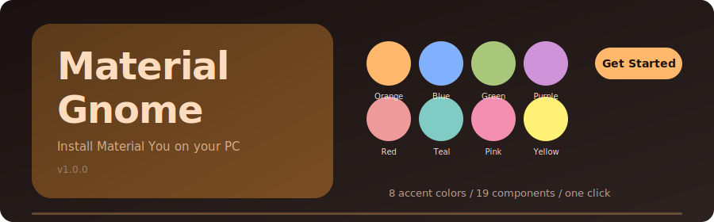

<p align="center">
  
</p>

<p align="center">
  <a href="#quick-start"></a>&nbsp;
  &nbsp;
  &nbsp;
  
</p>

---

<br>

### Your desktop deserves better than default Adwaita.

Material Gnome is a full-system Material You dark theme for GNOME. It replaces the look of every surface you interact with daily -- the top bar, the app grid, Nautilus, Settings, Firefox, your terminal, even the boot screen -- with a cohesive, warm, Material Design 3 aesthetic.

The project ships as a **native GTK4 / libadwaita installer** with an adaptive layout that feels at home on both a laptop and a widescreen monitor. Pick one of **8 accent colors**, toggle the **19 components** you want, hit install, and walk away. Everything is backed up automatically. Nothing is irreversible.

Need to change your mind later? Open the installer, pick a new color, press **Aggiorna**, and watch your entire desktop -- CSS files, Papirus folder icons, terminal palette, GNOME accent color, running GTK apps -- shift hue in real time. No logout. No restart.

Built and tested on **Bazzite / Fedora Silverblue** (GNOME 49.1, Wayland, immutable root), but works on any distribution running GNOME 45 or later.

<br>

<p align="center">
  
</p>

<br>

---

<br>

<p align="center">
  
</p>

<p align="center">
  <sub>Home screen -- system detection, feature overview, and the hero card. Adaptive two-column layout.</sub>
</p>

<br>

<p align="center">
  
</p>

<p align="center">
  <sub>Color picker -- 8 Material You palettes with live preview of primary, container, and surface tokens.</sub>
</p>

<br>

<p align="center">
  
  &nbsp;&nbsp;&nbsp;&nbsp;
  
</p>

<p align="center">
  <sub>Compact layout with bottom navigation and component selection with per-step install detection.</sub>
</p>

<br>

---

<br>

## What gets installed

| | Component | What it does |
|:---:|---|---|
|  | **GNOME Shell** | Top bar, quick settings, notifications, OSD, overview, calendar, lock screen |
|  | **GTK4 / libadwaita** | Nautilus, Settings, Text Editor, and every modern GNOME app |
|  | **GTK3** | Legacy application styling |
|  | **Ptyxis Terminal** | Palette with matched background, cursor, selection, and ANSI colors |
|  | **Fastfetch** | Styled terminal system info display |
|  | **Burn My Windows** | Window close animation profile |
|  | **Wallpaper** | Dark lockscreen wallpaper |
|  | **Fonts** | Inter, Fira Code, Noto Serif |
|  | **Papirus Icons** | Papirus-Dark with accent-colored folders |
|  | **Bibata Cursors** | Bibata Modern Classic cursor theme |
|  | **12 Extensions** | Logo Menu, Blur, AppIndicator, Tiling, Compiz effects, and more |
|  | **57 dconf Settings** | Accent color, Flatpak overrides, night light, keybindings |
|  | **Flatpak Overrides** | Global GTK theme override for sandboxed apps |
|  | **Flatpak Symlinks** | Per-app CSS symlinks for theme consistency |
|  | **Firefox** | Custom `userChrome.css` and `userContent.css` |
|  | **GDM** | Login screen with matching colors and font |
|  | **DING** | Desktop icons priority fix |
|  | **rEFInd** | Boot manager theme |
|  | **rEFInd Theme** | Background, selection icons, and OS logos for the boot screen |

<br>

## Accent colors

Pick once, change anytime. The **Aggiorna** engine uses HSL hue-shifting to remap every color in every CSS file -- not just the 24 palette tokens, but all derived and intermediate shades. Papirus folder symlinks, dconf accent keys, and terminal palettes are updated in the same pass.

<p align="center">
&nbsp;
&nbsp;
&nbsp;
&nbsp;
&nbsp;
&nbsp;
&nbsp;

</p>

<p align="center">
  <sub>Orange &nbsp;&middot;&nbsp; Blue &nbsp;&middot;&nbsp; Green &nbsp;&middot;&nbsp; Purple &nbsp;&middot;&nbsp; Red &nbsp;&middot;&nbsp; Teal &nbsp;&middot;&nbsp; Pink &nbsp;&middot;&nbsp; Yellow</sub>
</p>

<br>

---

<br>

## Quick start

```bash
git clone https://github.com/mengo1234/material-gnome.git
cd material-gnome
python3 material-you-installer-gui.py
```

Or run the TUI installer in any terminal:

```bash
python3 material_you_installer.py
```

<br>

## Requirements

| | |
|---|---|
| **Desktop** | GNOME 45+ (tested on 49.1) |
| **Python** | 3.10+ |
| **GUI deps** | `gtk4`, `libadwaita` |
| **Elevated** | `sudo` for GDM, rEFInd, Plymouth, DING |

<br>

## How it works

```
theme/
  gnome-shell/   ->  ~/.themes/Material-You-Orange/gnome-shell/
  gtk-4.0/       ->  ~/.config/gtk-4.0/
  gtk-3.0/       ->  ~/.config/gtk-3.0/
  firefox/       ->  ~/.mozilla/firefox/<profile>/chrome/
  ptyxis/        ->  ~/.local/share/org.gnome.Ptyxis/palettes/
  fastfetch/     ->  ~/.config/fastfetch/
  wallpaper/     ->  lockscreen background
  gdm/           ->  /etc/dconf/db/gdm.d/
  refind/        ->  /boot/efi/EFI/refind/
```

Already-installed components show a checkmark. Every step creates a timestamped backup before touching anything. On immutable distros (Bazzite, Silverblue, Kinoite) the installer uses `/etc` overlays automatically.

<br>

## Uninstall

```bash
python3 material_you_installer.py
# Select "Restore" to roll back individual components or everything at once
```

Backups live in `~/.local/share/material-you-orange/backups/`.

<br>

## Project structure

```
material-you-installer-gui.py    GTK4 / libadwaita GUI application
material_you_installer.py        TUI installer and core step engine
material-you-installer.py        Legacy TUI entry point
theme/                           Pre-built CSS, configs, and assets
screenshots/                     App screenshots and visual assets
```

<br>

---

<p align="center">
  <sub>MIT License</sub>
</p>
